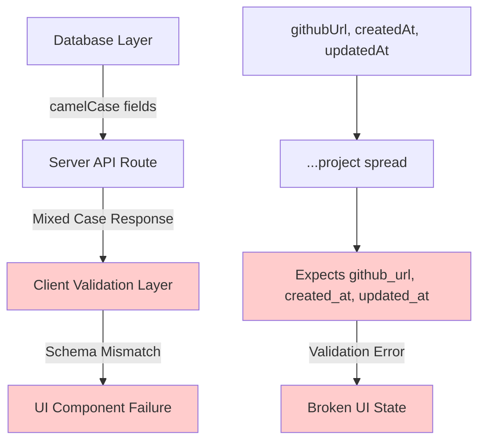
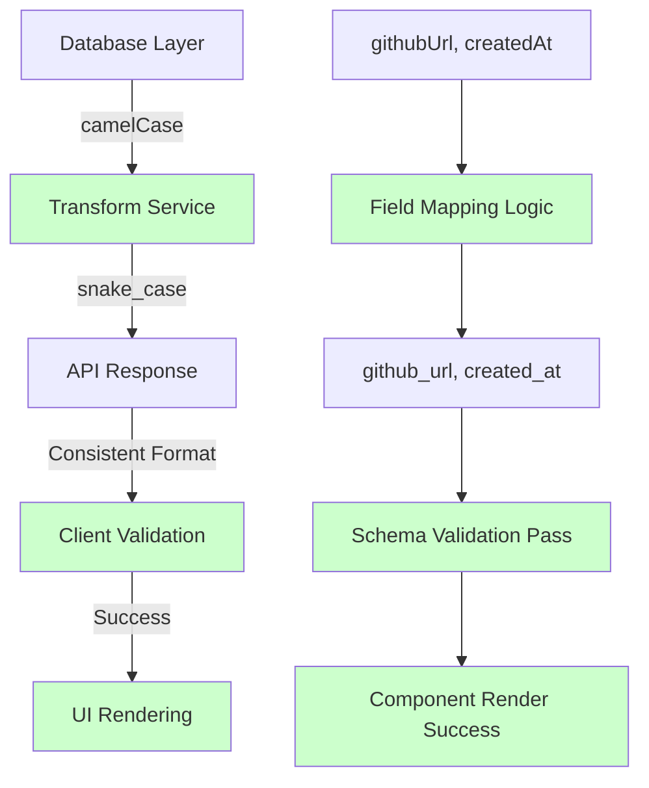

# API Projects Case Mapping Design

## Overview

This design addresses critical API case mapping inconsistencies in the HackerFolio full-stack application where the `/api/projects` endpoint returns mixed camelCase and snake_case fields, causing validation failures and UI rendering issues. The client expects consistent `snake_case` fields (`github_url`, `live_url`, `created_at`, `updated_at`) but the server spreads database rows containing camelCase fields (`githubUrl`, `createdAt`, etc.).

## Architecture

### Current State Analysis



**Problem Flow:**
1. Database ORM returns camelCase fields (`githubUrl`, `createdAt`, `updatedAt`)
2. Server API spreads database rows without field transformation
3. Client validation schemas expect snake_case format
4. Validation layer rejects inconsistent field names
5. UI components fail to render or display incomplete project data

### Target Architecture



## Technology Stack & Dependencies

### Server Stack
- **Runtime**: Bun with Elysia framework
- **Database**: SQLite/PostgreSQL with ORM (camelCase conventions)
- **API Layer**: RESTful endpoints with JSON responses

### Client Stack
- **Framework**: React with TypeScript
- **Build Tool**: Vite with SSR support
- **Validation**: Zod schemas expecting snake_case
- **Styling**: Tailwind CSS v4

### Build Configuration
- **Root Directory**: `client/` for Vite configuration
- **Output**: `dist/public/` for client builds, `dist/server/` for SSR
- **Proxy**: `/api` routes proxy to `http://localhost:3001`

## Data Models & ORM Mapping

### Database Schema (camelCase Convention)
```typescript
interface ProjectDatabaseRow {
  id: number;
  name: string;
  description?: string;
  techStack?: string; // JSON stringified array
  githubUrl?: string;
  liveUrl?: string;
  status?: string;
  createdAt?: Date;
  updatedAt?: Date;
}
```

### Client Schema Expectations (snake_case Convention)
```typescript
interface ProjectAPIResponse {
  id: number;
  name: string;
  description: string;
  tech_stack: string[]; // Parsed JSON array
  github_url?: string;
  live_url?: string;
  status?: string;
  created_at?: string; // ISO date string
  updated_at?: string; // ISO date string
}
```

### Field Mapping Strategy

| Database Field | API Field | Transformation |
|---------------|-----------|----------------|
| `id` | `id` | Direct mapping |
| `name` | `name` | Direct mapping |
| `description` | `description` | Default to empty string |
| `techStack` | `tech_stack` | JSON.parse() + array validation |
| `githubUrl` | `github_url` | Optional field mapping |
| `liveUrl` | `live_url` | Optional field mapping |
| `status` | `status` | Optional field mapping |
| `createdAt` | `created_at` | Date → ISO string |
| `updatedAt` | `updated_at` | Date → ISO string |

## API Endpoints Reference

### GET /api/projects

**Current Implementation (Problematic)**
```typescript
// server/routes/api.ts - BEFORE
const transformedProjects = validatedProjects.map(project => ({
  ...project, // Spreads camelCase fields from database
  tech_stack: project.techStack ? JSON.parse(project.techStack) : [],
}))
```

**Fixed Implementation**
```typescript
// server/routes/api.ts - AFTER
const transformedProjects = validatedProjects.map((project) => ({
  id: project.id,
  name: project.name,
  description: project.description ?? '',
  tech_stack: project.techStack ? JSON.parse(project.techStack) : [],
  github_url: project.githubUrl ?? undefined,
  live_url: project.liveUrl ?? undefined,
  status: project.status ?? undefined,
  created_at: project.createdAt ?? undefined,
  updated_at: project.updatedAt ?? undefined,
}))
```

**Request/Response Schema**
```yaml
GET /api/projects:
  responses:
    200:
      content:
        application/json:
          schema:
            type: array
            items:
              type: object
              required: [id, name, description, tech_stack]
              properties:
                id: { type: number }
                name: { type: string }
                description: { type: string }
                tech_stack: 
                  type: array
                  items: { type: string }
                github_url: { type: string, format: uri }
                live_url: { type: string, format: uri }
                status: { type: string }
                created_at: { type: string, format: date-time }
                updated_at: { type: string, format: date-time }
```

**Authentication Requirements**
- No authentication required for public project listing
- Rate limiting applied via security middleware
- CORS headers configured for client domain

## Business Logic Layer

### Data Transformation Service

```typescript
// server/services/projectTransformService.ts
export class ProjectTransformService {
  /**
   * Transform database row to API response format
   * Converts camelCase to snake_case and handles data type transformations
   */
  static transformToAPIFormat(project: ProjectDatabaseRow): ProjectAPIResponse {
    return {
      id: project.id,
      name: project.name,
      description: project.description ?? '',
      tech_stack: this.parseTechStack(project.techStack),
      github_url: project.githubUrl ?? undefined,
      live_url: project.liveUrl ?? undefined,
      status: project.status ?? undefined,
      created_at: project.createdAt?.toISOString() ?? undefined,
      updated_at: project.updatedAt?.toISOString() ?? undefined,
    };
  }

  /**
   * Parse and validate tech stack JSON string
   * Returns empty array if parsing fails
   */
  private static parseTechStack(techStack?: string): string[] {
    if (!techStack) return [];
    
    try {
      const parsed = JSON.parse(techStack);
      return Array.isArray(parsed) ? parsed.filter(item => typeof item === 'string') : [];
    } catch (error) {
      console.warn('Failed to parse tech stack:', error);
      return [];
    }
  }

  /**
   * Transform API format back to database format
   * For POST/PUT operations
   */
  static transformToDatabaseFormat(apiProject: Partial<ProjectAPIResponse>): Partial<ProjectDatabaseRow> {
    return {
      id: apiProject.id,
      name: apiProject.name,
      description: apiProject.description,
      techStack: apiProject.tech_stack ? JSON.stringify(apiProject.tech_stack) : undefined,
      githubUrl: apiProject.github_url,
      liveUrl: apiProject.live_url,
      status: apiProject.status,
      createdAt: apiProject.created_at ? new Date(apiProject.created_at) : undefined,
      updatedAt: apiProject.updated_at ? new Date(apiProject.updated_at) : undefined,
    };
  }
}
```

### Validation Layer

```typescript
// server/validators/projectValidator.ts
import { z } from 'zod';

const ProjectDatabaseSchema = z.object({
  id: z.number(),
  name: z.string(),
  description: z.string().optional(),
  techStack: z.string().optional(),
  githubUrl: z.string().url().optional(),
  liveUrl: z.string().url().optional(),
  status: z.string().optional(),
  createdAt: z.date().optional(),
  updatedAt: z.date().optional(),
});

const ProjectAPISchema = z.object({
  id: z.number(),
  name: z.string(),
  description: z.string(),
  tech_stack: z.array(z.string()),
  github_url: z.string().url().optional(),
  live_url: z.string().url().optional(),
  status: z.string().optional(),
  created_at: z.string().datetime().optional(),
  updated_at: z.string().datetime().optional(),
});

export const validateDatabaseProject = (project: unknown) => 
  ProjectDatabaseSchema.parse(project);

export const validateAPIProject = (project: unknown) => 
  ProjectAPISchema.parse(project);
```

## Middleware & Interceptors

### Security Middleware Fix

**Current Implementation (Incorrect)**
```typescript
// server/app.ts - BEFORE (Wrong Hook)
const securityMiddleware = (context: Context, next: () => void) => {
  applySecurityHeaders(context)
  const ok = rateLimit(defaultRateLimitOptions)(context)
  if (!ok) {
    return new Response(
      JSON.stringify({ success: false, error: { code: 'RATE_LIMIT_EXCEEDED', message: 'Too many requests' } }),
      { status: 429, headers: { 'Content-Type': 'application/json' } }
    )
  }
  return next()
}

app.derive(securityMiddleware) // Wrong API usage
```

**Fixed Implementation**
```typescript
// server/app.ts - AFTER (Correct Hook)
const securityMiddleware = (context: Context) => {
  applySecurityHeaders(context)
  const ok = rateLimit(defaultRateLimitOptions)(context)
  if (!ok) {
    return new Response(
      JSON.stringify({ 
        success: false, 
        error: { 
          code: 'RATE_LIMIT_EXCEEDED', 
          message: 'Too many requests' 
        } 
      }),
      { 
        status: 429, 
        headers: { 'Content-Type': 'application/json' } 
      }
    )
  }
}

app.onRequest(securityMiddleware) // Correct API usage
```

### Response Transformation Middleware

```typescript
// server/middleware/responseTransform.ts
export const responseTransformMiddleware = (context: Context) => {
  const originalJson = context.set.headers;
  
  // Add consistent response headers
  context.set.headers = {
    ...context.set.headers,
    'Content-Type': 'application/json',
    'X-API-Version': '1.0',
    'Cache-Control': 'no-cache'
  };
};
```

## Component Architecture

### Client-Side Data Fetching

```typescript
// client/src/hooks/useProjects.ts
interface Project {
  id: number;
  name: string;
  description: string;
  tech_stack: string[];
  github_url?: string;
  live_url?: string;
  status?: string;
  created_at?: string;
  updated_at?: string;
}

export const useProjects = () => {
  const [projects, setProjects] = useState<Project[]>([]);
  const [loading, setLoading] = useState(true);
  const [error, setError] = useState<string | null>(null);

  useEffect(() => {
    fetch('/api/projects')
      .then(res => res.json())
      .then((data: Project[]) => {
        // Data already in expected snake_case format
        setProjects(data);
        setLoading(false);
      })
      .catch(err => {
        setError(err.message);
        setLoading(false);
      });
  }, []);

  return { projects, loading, error };
};
```

### Component Hierarchy

```mermaid
graph TD
    A[ProjectsPage] --> B[ProjectList]
    B --> C[ProjectCard]
    C --> D[ProjectDetails]
    C --> E[TechStack]
    C --> F[ProjectLinks]
    
    A1[useProjects Hook] --> B1[Project[] State]
    B1 --> C1[Individual Project Props]
    C1 --> D1[name, description]
    C1 --> E1[tech_stack Array]
    C1 --> F1[github_url, live_url]
```

### Props/State Management

```typescript
// client/src/components/ProjectCard.tsx
interface ProjectCardProps {
  project: {
    id: number;
    name: string;
    description: string;
    tech_stack: string[];
    github_url?: string;
    live_url?: string;
    status?: string;
    created_at?: string;
    updated_at?: string;
  };
}

const ProjectCard: React.FC<ProjectCardProps> = ({ project }) => {
  return (
    <div className="project-card">
      <h3>{project.name}</h3>
      <p>{project.description}</p>
      <div className="tech-stack">
        {project.tech_stack.map((tech, index) => (
          <span key={index} className="tech-tag">{tech}</span>
        ))}
      </div>
      <div className="project-links">
        {project.github_url && (
          <a href={project.github_url} target="_blank" rel="noopener noreferrer">
            GitHub
          </a>
        )}
        {project.live_url && (
          <a href={project.live_url} target="_blank" rel="noopener noreferrer">
            Live Demo
          </a>
        )}
      </div>
    </div>
  );
};
```

## Testing Strategy

### Unit Testing for Transformation Logic

```typescript
// server/tests/projectTransform.test.ts
import { describe, it, expect } from 'vitest';
import { ProjectTransformService } from '../services/projectTransformService';

describe('ProjectTransformService', () => {
  it('should transform camelCase database fields to snake_case API fields', () => {
    const databaseProject = {
      id: 1,
      name: 'Test Project',
      description: 'A test project',
      techStack: '["React", "TypeScript"]',
      githubUrl: 'https://github.com/user/repo',
      liveUrl: 'https://example.com',
      status: 'active',
      createdAt: new Date('2024-01-01'),
      updatedAt: new Date('2024-01-02'),
    };

    const result = ProjectTransformService.transformToAPIFormat(databaseProject);

    expect(result).toEqual({
      id: 1,
      name: 'Test Project',
      description: 'A test project',
      tech_stack: ['React', 'TypeScript'],
      github_url: 'https://github.com/user/repo',
      live_url: 'https://example.com',
      status: 'active',
      created_at: '2024-01-01T00:00:00.000Z',
      updated_at: '2024-01-02T00:00:00.000Z',
    });
  });

  it('should handle missing optional fields gracefully', () => {
    const minimalProject = {
      id: 1,
      name: 'Minimal Project',
    };

    const result = ProjectTransformService.transformToAPIFormat(minimalProject);

    expect(result).toEqual({
      id: 1,
      name: 'Minimal Project',
      description: '',
      tech_stack: [],
      github_url: undefined,
      live_url: undefined,
      status: undefined,
      created_at: undefined,
      updated_at: undefined,
    });
  });

  it('should handle malformed JSON in techStack gracefully', () => {
    const projectWithBadJson = {
      id: 1,
      name: 'Bad JSON Project',
      techStack: 'invalid json',
    };

    const result = ProjectTransformService.transformToAPIFormat(projectWithBadJson);

    expect(result.tech_stack).toEqual([]);
  });
});
```

### Integration Testing for API Endpoints

```typescript
// server/tests/api.integration.test.ts
import { describe, it, expect, beforeAll, afterAll } from 'vitest';
import { app } from '../app';

describe('GET /api/projects', () => {
  it('should return projects in snake_case format', async () => {
    const response = await app.handle(
      new Request('http://localhost/api/projects')
    );
    
    expect(response.status).toBe(200);
    
    const projects = await response.json();
    expect(Array.isArray(projects)).toBe(true);
    
    if (projects.length > 0) {
      const project = projects[0];
      expect(project).toHaveProperty('tech_stack');
      expect(project).toHaveProperty('github_url');
      expect(project).toHaveProperty('live_url');
      expect(project).toHaveProperty('created_at');
      expect(project).toHaveProperty('updated_at');
      
      // Should not have camelCase fields
      expect(project).not.toHaveProperty('techStack');
      expect(project).not.toHaveProperty('githubUrl');
      expect(project).not.toHaveProperty('liveUrl');
      expect(project).not.toHaveProperty('createdAt');
      expect(project).not.toHaveProperty('updatedAt');
    }
  });

  it('should handle empty project list', async () => {
    // Test with empty database
    const response = await app.handle(
      new Request('http://localhost/api/projects')
    );
    
    expect(response.status).toBe(200);
    const projects = await response.json();
    expect(Array.isArray(projects)).toBe(true);
  });
});
```