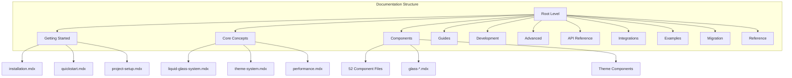
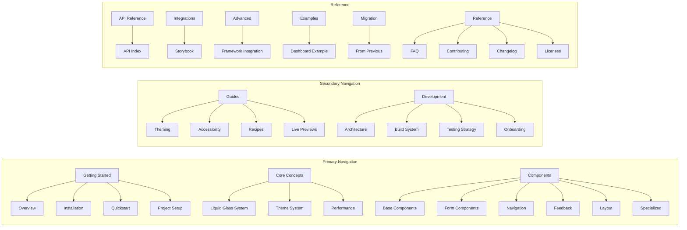

# Mintlify Apple Theme Implementation Design

## Overview

This document outlines the design for implementing a complete Mintlify documentation site for LiqUIdify with a clean Apple Developer-inspired aesthetic. The implementation will transform the existing MDX documentation into a production-ready Mintlify site with proper navigation, theming, and Apple-style visual design.

## Repository Analysis

### Current Structure
The LiqUIdify repository is a monorepo containing a comprehensive React component library with glassmorphism design. The existing documentation resides in `apps/docs/` with:
- 60+ MDX files across multiple categories
- Existing SVG logo and favicon assets
- Component showcase files and React components
- Organized folder structure by feature areas

### Documentation Categories
Based on the existing MDX files, the documentation is organized into:



## Implementation Architecture

### Configuration Strategy
The implementation uses Mintlify's `docs.json` configuration with:
- Apple Developer-inspired theme customization
- System font stack for native Apple experience
- Semantic color variables for light/dark modes
- Organized navigation grouping with icons

### Visual Design Philosophy
Following Apple's Human Interface Guidelines:
- Clean, spacious typography with high contrast
- Subtle borders and dividers for organization
- Roomy line-height for readability
- GPU-accelerated animations where appropriate
- System font stack ensuring SF Pro on Apple devices

### Component Integration
The design maintains integration with LiqUIdify's existing:
- Theme provider system
- Glassmorphism effects
- Component showcase capabilities
- Interactive examples and previews

## Technical Specifications

### docs.json Configuration

```json
{
  "$schema": "https://mintlify.com/docs.json",
  "theme": "mint",
  "name": "LiqUIdify",
  "description": "Production-ready React component library with liquid glass design and physics-based interactions",
  "colors": {
    "primary": "#0071e3",
    "light": "#2997ff", 
    "dark": "#0a84ff"
  },
  "appearance": {
    "default": "system",
    "strict": false
  },
  "logo": {
    "light": "/Logo.svg",
    "dark": "/Logo.svg",
    "href": "https://github.com/yourusername/liquidify"
  },
  "favicon": "/Favicon.svg",
  "icons": { "library": "lucide" },
  "styling": {
    "eyebrows": "breadcrumbs",
    "codeblocks": "system"
  },
  "fonts": {
    "family": "-apple-system, BlinkMacSystemFont, 'Segoe UI', Roboto, Helvetica, Arial, 'Apple Color Emoji', 'Segoe UI Emoji', 'Segoe UI Symbol', sans-serif",
    "heading": { "family": "-apple-system, BlinkMacSystemFont, 'Segoe UI', Roboto, Helvetica, Arial, sans-serif" },
    "body": { "family": "-apple-system, BlinkMacSystemFont, 'Segoe UI', Roboto, Helvetica, Arial, sans-serif" }
  }
}
```

### Navigation Structure

The navigation follows a logical grouping strategy:



### Styling System

#### CSS Variables Implementation

```css
:root {
  /* Apple Brand Colors */
  --apple-blue: #0071e3;
  --ios-system-blue: #007AFF;
  --text: #111;
  --muted: #6b7280;
  --border: rgba(0,0,0,0.08);

  /* Apple HIG Typography Scale */
  --font-sans: -apple-system, BlinkMacSystemFont, 'Segoe UI', Roboto, Helvetica, Arial, 'Apple Color Emoji', 'Segoe UI Emoji', 'Segoe UI Symbol', sans-serif;
  --lh: 1.5;
  --fz-display: 34px;    /* Large Title */
  --fz-title1: 28px;     /* Title 1 */
  --fz-title2: 22px;     /* Title 2 */
  --fz-title3: 20px;     /* Title 3 */
  --fz-headline: 17px;   /* Headline */
  --fz-body: 17px;       /* Body */
  --fz-callout: 16px;    /* Callout */
  --fz-subhead: 15px;    /* Subheadline */
  --fz-footnote: 13px;   /* Footnote */
  --fz-caption1: 12px;   /* Caption 1 */
  --fz-caption2: 11px;   /* Caption 2 */
}

.dark:root {
  --text: #f5f5f7;
  --muted: #a1a1aa;
  --border: rgba(255,255,255,0.12);
}
```

#### Typography System

```css
body {
  font-family: var(--font-sans);
  line-height: var(--lh);
  color: var(--text);
  -webkit-font-smoothing: antialiased;
  -moz-osx-font-smoothing: grayscale;
}

/* Heading Scale Based on Apple HIG */
h1 { 
  font-size: var(--fz-display); 
  font-weight: 700; 
  letter-spacing: -0.01em;
  line-height: 1.2;
}

h2 { 
  font-size: var(--fz-title1); 
  font-weight: 700;
  line-height: 1.3;
}

h3 { 
  font-size: var(--fz-title2); 
  font-weight: 600;
  line-height: 1.4;
}

h4 { 
  font-size: var(--fz-title3); 
  font-weight: 600;
  line-height: 1.4;
}
```

#### Interactive Elements

```css
/* Apple-style Links and Buttons */
a, .link { 
  color: var(--apple-blue);
  text-decoration: none;
  transition: all 0.2s ease;
}

a:hover { 
  text-decoration: underline;
  color: var(--ios-system-blue);
}

/* Subtle Separators */
#navbar, #footer { 
  border-bottom: 1px solid var(--border);
  backdrop-filter: blur(20px);
  background: rgba(255, 255, 255, 0.8);
}

.dark #navbar, .dark #footer {
  background: rgba(0, 0, 0, 0.8);
}

/* Sidebar Styling */
.sidebar-group-header { 
  font-weight: 600;
  font-size: var(--fz-subhead);
  text-transform: uppercase;
  letter-spacing: 0.5px;
  color: var(--muted);
}
```

## Asset Management

### Logo Configuration
- **Source**: Existing `/apps/docs/Logo.svg` (120x120px)
- **Usage**: Both light and dark modes use same file
- **Optimization**: SVG is already optimized for scalability
- **Implementation**: Direct reference in docs.json

### Favicon Setup
- **Source**: Existing `/apps/docs/Favicon.svg` (32x32px)
- **Format**: SVG provides scalability for all device resolutions
- **Mintlify Handling**: Automatic size generation for different contexts
- **Implementation**: Single SVG reference in docs.json

## Page Organization Strategy

### Component Documentation
Components are organized by functional category:

| Category | Components | Icon |
|----------|------------|------|
| **Base Components** | glass-button, responsive-button, avatar, badge, banner | `component` |
| **Form Components** | form-field, glass-textarea, glass-number-input, glass-checkbox-group, glass-combobox, glass-date-picker, glass-file-upload, radio-group | `form-input` |
| **Navigation** | breadcrumbs, navbar, sidebar, glass-mobile-nav, tabs | `navigation` |
| **Feedback** | toast, notification, modal, drawer, popover, progress, loading, spinner | `message-circle` |
| **Layout** | portal, theme-provider, theme-toggle | `layout` |
| **Specialized** | liquid-glass, glass-chart, search, table, tree-view, timeline, slider, showcase | `settings` |

### Content Hierarchy
Each MDX file maintains its existing frontmatter structure:

```yaml
---
title: "Component Name"
description: "Brief description for SEO and navigation"
---
```

## Implementation Workflow

### Phase 1: Configuration Setup
1. Create `docs.json` with complete navigation structure
2. Implement Apple-inspired color scheme and typography
3. Configure logo and favicon references

### Phase 2: Asset Optimization
1. Verify SVG logo scaling at navbar height (24-32px)
2. Test favicon rendering across different device resolutions
3. Implement proper asset paths in configuration

### Phase 3: Navigation Implementation
1. Map all 60+ MDX files to appropriate navigation groups
2. Implement nested structure for component categories
3. Add appropriate Lucide icons for each section

### Phase 4: Styling Customization
1. Create minimal `styles.css` with Apple HIG variables
2. Implement light/dark mode color schemes
3. Add subtle animations and transitions

### Phase 5: Testing and Validation
1. Local development testing with `mintlify dev`
2. Navigation completeness verification
3. Asset rendering validation
4. Typography scale testing across devices

## Validation Criteria

### Design Requirements
- ✅ Apple Developer-inspired visual aesthetic
- ✅ Clean typography using system font stack
- ✅ Light/dark mode support with semantic colors
- ✅ Consistent spacing and layout based on Apple HIG

### Technical Requirements
- ✅ Complete navigation covering all 60+ MDX files
- ✅ Proper logo and favicon integration
- ✅ Valid docs.json schema compliance
- ✅ Functional local development environment

### User Experience Requirements
- ✅ Intuitive navigation grouping
- ✅ Fast loading and smooth transitions
- ✅ Responsive design across devices
- ✅ Accessible color contrast and interactions

## Quality Assurance

### Testing Checklist
- [ ] All MDX files appear exactly once in navigation
- [ ] Logo displays correctly at proper scale in navbar
- [ ] Favicon generates all required sizes automatically
- [ ] Light/dark toggle functions properly
- [ ] Typography scales appropriately on different screen sizes
- [ ] Color contrast meets accessibility standards
- [ ] Navigation grouping follows logical organization
- [ ] Search functionality works across all content
- [ ] Mobile navigation is fully functional
- [ ] Performance optimization for fast loading

### Browser Compatibility
- **Primary**: Safari, Chrome (Apple ecosystem focus)
- **Secondary**: Firefox, Edge
- **Mobile**: iOS Safari, Chrome Mobile
- **Requirements**: Modern browsers with CSS custom properties support

## Maintenance Strategy

### Content Updates
- MDX files remain editable in existing locations
- Navigation updates via docs.json modifications
- Theme customization through CSS variables

### Asset Management
- Logo updates: Replace SVG file in apps/docs/
- Favicon updates: Replace SVG file in apps/docs/
- Icon changes: Update Lucide icon references in docs.json

### Performance Monitoring
- Bundle size tracking for CSS overrides
- Page load time optimization
- Search index performance
- Mobile responsiveness testing

This design provides a comprehensive foundation for implementing a production-ready Mintlify documentation site that maintains the high-quality standards of the LiqUIdify component library while delivering an Apple Developer-inspired user experience.


