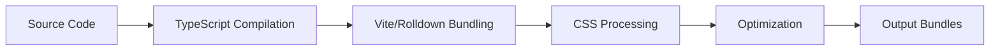

# Build System

LiqUIdify uses a modern build system powered by Vite and Rolldown to deliver optimized, tree-shakeable bundles. This guide explains the build configuration, bundling strategy, and optimization techniques.

## 🛠️ Build Stack Overview

### Core Technologies

- **Vite**: Lightning-fast build tool with native ESM support
- **Rolldown**: Rust-based bundler for production builds
- **LightningCSS**: Fast CSS transformer and minifier
- **TypeScript**: Type checking and declaration generation
- **Bun**: Package manager and task runner

### Build Pipeline



## 📦 Bundling Strategy

### Entry Points

LiqUIdify provides multiple entry points for optimal tree-shaking:

```typescript
// Main entry point
export * from "./components";
export * from "./hooks";
export * from "./theme";
export * from "./utils";

// Modular bundles
export * as core from "./bundles/core";
export * as forms from "./bundles/forms";
export * as navigation from "./bundles/navigation";
export * as feedback from "./bundles/feedback";
```

### Output Structure

```
dist/libs/components/
├── index.mjs              # ESM entry point
├── index.cjs              # CommonJS entry point
├── index.d.ts             # TypeScript declarations
├── liquidify.css          # Global styles
├── bundles/               # Modular bundles
│   ├── core.d.ts
│   ├── forms.d.ts
│   ├── navigation.d.ts
│   └── feedback.d.ts
└── chunks/                # Code-split chunks
    └── [name]-[hash].mjs
```

## ⚙️ Rolldown Configuration

### Core Configuration

```typescript
// libs/components/rolldown.config.ts
import { defineConfig } from "vite";
import react from "@vitejs/plugin-react";
import tsconfigPaths from "vite-tsconfig-paths";
import lightningcss from "vite-plugin-lightningcss";

export default defineConfig({
  plugins: [
    react(),
    tsconfigPaths(),
    lightningcss({
      browserslist: ">0.5%, last 2 versions, not dead",
      cssModules: false,
    }),
  ],
  build: {
    lib: {
      entry: resolve(__dirname, "src/index.ts"),
      name: "LiquidifyComponents",
      formats: ["es", "cjs"],
      fileName: (format) => `index.${format === "es" ? "mjs" : "cjs"}`,
    },
    outDir: resolve(__dirname, "../../dist/libs/components"),
    cssCodeSplit: false,
    cssMinify: "lightningcss",
    sourcemap: true,
    minify: "esbuild",
  },
});
```

### External Dependencies

Dependencies are externalized to reduce bundle size:

```typescript
rollupOptions: {
  external: [
    'react',
    'react-dom',
    'react/jsx-runtime',
    /^@radix-ui/,
    'clsx',
    'framer-motion',
    'lucide-react',
    'tailwind-merge',
  ],
}
```

### Chunk Strategy

Optimized chunking for better caching:

```typescript
output: {
  manualChunks: (id) => {
    if (id.includes('node_modules')) {
      if (id.includes('@radix-ui')) return 'radix'
      if (id.includes('framer-motion')) return 'motion'
      if (id.includes('lucide-react')) return 'icons'
    }
    if (id.includes('components/')) {
      const component = id.split('components/')[1].split('/')[0]
      return `component-${component}`
    }
  },
}
```

## 🌲 Tree-Shaking

### How It Works

LiqUIdify is designed for optimal tree-shaking:

1. **Named Exports**: All components use named exports
2. **Side-Effect Free**: Marked in package.json
3. **ESM First**: Modern module format by default
4. **Modular CSS**: Component-specific styles

### Package.json Configuration

```json
{
  "sideEffects": ["*.css", "src/styles/**"],
  "exports": {
    ".": {
      "types": "./dist/libs/components/index.d.ts",
      "import": "./dist/libs/components/index.mjs",
      "require": "./dist/libs/components/index.cjs"
    },
    "./button": {
      "types": "./dist/libs/components/components/button/index.d.ts",
      "import": "./dist/libs/components/index.mjs",
      "require": "./dist/libs/components/index.cjs"
    }
  }
}
```

### Usage for Tree-Shaking

```typescript
// ✅ Good - Only imports GlassButton
import { GlassButton } from "liquidify/button";

// ❌ Bad - Imports entire library
import * as Liquid from "liquidify";
```

## 🎨 CSS Processing

### LightningCSS Configuration

```typescript
lightningcss({
  browserslist: ">0.5%, last 2 versions, not dead",
  cssModules: false,
  minify: true,
  sourceMap: true,
  targets: {
    chrome: 95,
    firefox: 90,
    safari: 14,
    edge: 95,
  },
});
```

### CSS Architecture

1. **Global Styles**: Base reset and theme variables
2. **Component Styles**: Scoped to components
3. **Utility Classes**: Optional Tailwind integration
4. **CSS Variables**: Dynamic theming

```css
/* Global theme variables */
:root {
  --lg-primary: #007aff;
  --lg-blur: 10px;
  --lg-saturation: 120%;
}

/* Component-specific styles */
.glass-button {
  backdrop-filter: blur(var(--lg-blur));
  background: var(--lg-bg-color);
}

/* Utility classes (optional) */
.bg-liquid {
  background: var(--lg-bg-color);
}
```

## 📊 Build Optimization

### Performance Optimizations

1. **Code Splitting**

   ```typescript
   // Dynamic imports for heavy components
   const GlassChart = () => import("./components/glass-chart");
   ```

2. **Minification**

   ```typescript
   build: {
     minify: 'esbuild', // Fast minification
     target: 'es2015',  // Modern browsers
   }
   ```

3. **Compression**

   ```typescript
   import compression from "vite-plugin-compression";

   plugins: [
     compression({
       algorithm: "gzip",
       ext: ".gz",
     }),
     compression({
       algorithm: "brotliCompress",
       ext: ".br",
     }),
   ];
   ```

### Bundle Analysis

```bash
# Analyze bundle composition
bun run build:analyze

# Generate bundle report
bun run build -- --report

# Check bundle size
bun run bundle:size
```

### Size Budgets

```json
{
  "bundlesize": [
    {
      "path": "./dist/libs/components/index.mjs",
      "maxSize": "30KB"
    },
    {
      "path": "./dist/libs/components/liquidify.css",
      "maxSize": "10KB"
    }
  ]
}
```

## 🔧 Build Scripts

### Available Scripts

```bash
# Development build (watch mode)
bun run dev

# Production build
bun run build

# Build library only
bun run build:lib

# Build types only
bun run build:types

# Build and analyze
bun run build:analyze

# Clean build artifacts
bun run clean
```

### Build Process Flow

```bash
# Full build process
bun run clean              # Remove previous build
bun run build:lib          # Build with Vite/Rolldown
bun run build:types        # Generate TypeScript declarations
bun run build:validate     # Validate output
```

## 🚀 Advanced Configuration

### Custom Build Targets

```typescript
// Build for specific environments
export default defineConfig(({ mode }) => ({
  build: {
    target: mode === "modern" ? "esnext" : "es2015",
    minify: mode === "production" ? "esbuild" : false,
  },
}));
```

### Module Federation

```typescript
// Future: Module federation support
import federation from "@originjs/vite-plugin-federation";

plugins: [
  federation({
    name: "liquidify",
    filename: "remoteEntry.js",
    exposes: {
      "./Button": "./src/components/glass-button",
      "./Card": "./src/components/glass-card",
    },
  }),
];
```

### Custom Plugins

```typescript
// Custom Vite plugin for component metadata
function componentMetadata() {
  return {
    name: "component-metadata",
    transform(code, id) {
      if (id.includes("components/")) {
        // Add component metadata
        return {
          code: code + "\n// Component: " + id,
          map: null,
        };
      }
    },
  };
}
```

## 📈 Performance Metrics

### Build Performance

- **Cold Build**: < 10 seconds
- **Hot Reload**: < 100ms
- **Type Checking**: < 5 seconds
- **CSS Processing**: < 2 seconds

### Bundle Metrics

| Bundle     | Raw Size | Gzipped | Brotli |
| ---------- | -------- | ------- | ------ |
| Core       | 85KB     | 28KB    | 24KB   |
| Forms      | 45KB     | 15KB    | 13KB   |
| Navigation | 35KB     | 12KB    | 10KB   |
| Full       | 165KB    | 55KB    | 47KB   |

## 🐛 Troubleshooting

### Common Build Issues

**Issue**: Build fails with memory error

```bash
# Solution: Increase Node memory
NODE_OPTIONS="--max-old-space-size=4096" bun run build
```

**Issue**: CSS not included in bundle

```typescript
// Solution: Import CSS in entry point
import "./styles/index.css";
```

**Issue**: TypeScript declarations missing

```bash
# Solution: Run type generation separately
bun run build:types
```

**Issue**: Tree-shaking not working

```json
// Solution: Check sideEffects in package.json
{
  "sideEffects": false
}
```

## 🔄 Continuous Integration

### CI Build Pipeline

```yaml
# .github/workflows/build.yml
name: Build
on: [push, pull_request]

jobs:
  build:
    runs-on: ubuntu-latest
    steps:
      - uses: actions/checkout@v3
      - uses: oven-sh/setup-bun@v1
      - run: bun install
      - run: bun run build
      - run: bun run test:build
      - uses: actions/upload-artifact@v3
        with:
          name: build-artifacts
          path: dist/
```

### Build Validation

```typescript
// scripts/validate-build.ts
import { existsSync, statSync } from "fs";
import { resolve } from "path";

const requiredFiles = [
  "dist/libs/components/index.mjs",
  "dist/libs/components/index.cjs",
  "dist/libs/components/index.d.ts",
  "dist/libs/components/liquidify.css",
];

requiredFiles.forEach((file) => {
  const path = resolve(process.cwd(), file);
  if (!existsSync(path)) {
    throw new Error(`Missing required file: ${file}`);
  }

  const stats = statSync(path);
  console.log(`✓ ${file} (${stats.size} bytes)`);
});
```

## 📚 Related Documentation

- [Architecture](./architecture): System design and patterns
- [Testing Strategy](./testing-strategy): Testing the build
- [Performance Guide](/guides/performance): Runtime optimization
- [Contributing](/contributing): Build contribution guidelines
